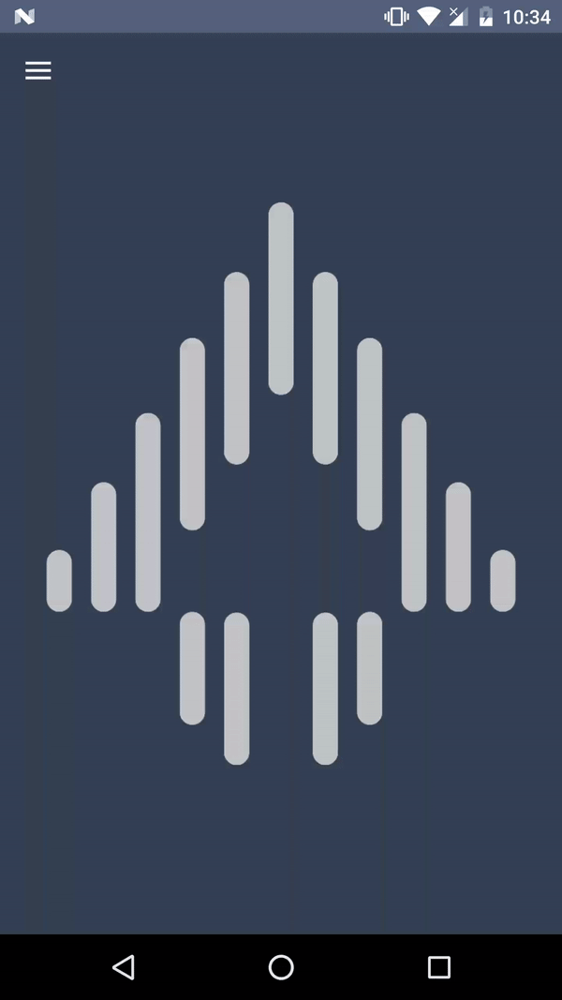

Usage
-----
AreaImageView object works almost the same as well known ImageView.
The difference is that it allows you to listen to clicks of specified areas of an image that has been added to the view.

First of all, you have to define set of pixel points on your image.
You can do that with the AreaImageViewSample application by choosing your image and creating a path with vertices or you can checkpoint of pixels with any image editor.

AreaImageView allows you to add two different types of listeners. Multi vertex listener and circle listener. The first one may contain gaps you want to exclude.

Creating and adding multi vertex area is that simple:

```java
ArrayList<Point> points = new ArrayList<>();
points.add(new Point(95, 492));
points.add(new Point(97, 571));
points.add(new Point(70, 575));
points.add(new Point(70, 495));

mAreaImage.addMultiVertexClickableArea(points, R.drawable.sample1);
```
Now you can listen on clicks and obtain information about callback with tag:

````java
mAreaImage.addAreaListener((tag) ->
{
    mAreaImage.setImageDrawable(ContextCompat.getDrawable(getActivity(), (int) tag));
});
````


Things to do
------------

* Pinch zoom
* Separated thread for checking if point is inside area

License
-------

    Copyright (C) 2015-2017 Appformation Sp. z o.o.

    Licensed under the Apache License, Version 2.0 (the "License");
    you may not use this file except in compliance with the License.
    You may obtain a copy of the License at

       http://www.apache.org/licenses/LICENSE-2.0

    Unless required by applicable law or agreed to in writing, software
    distributed under the License is distributed on an "AS IS" BASIS,
    WITHOUT WARRANTIES OR CONDITIONS OF ANY KIND, either express or implied.
    See the License for the specific language governing permissions and
    limitations under the License.

 [polygon-contains-point]: https://github.com/sromku/polygon-contains-point